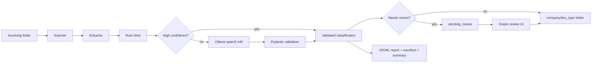

# AI-Assisted Document Sorting

Near-production-ready proof-of-concept for sorting incoming business documents
by company and document type using deterministic rules plus a local Ollama model.

The workflow scans `sample_input/`, extracts document context, classifies files,
and copies them into:

```text
sample_output/{company}/{doc_type}/filename
```

Low-confidence, unknown, or conflicting files are routed to
`sample_output/pending_review/` for manual review.

## Features

- Recursive scan and watch mode
- Batch limit support with `--max-files`
- TXT, CSV, Markdown, PDF, DOCX, and image support
- Optional OCR through Tesseract
- Hybrid rules + Ollama classification
- qwen3:14b primary model with rule fallback
- Structured JSON validation with Pydantic
- SHA-256 + file size duplicate detection
- JSONL audit report and JSON summary statistics
- Loguru console and rotating file logs
- Gradio review UI
- Dockerfile and Docker Compose with Ollama

## How To Run Locally

```bash
python -m venv .venv
source .venv/bin/activate
pip install -r requirements.txt

ollama pull qwen3:14b
cp config.example.yaml config.yaml
python generate_test_files.py
python -m docsort.main scan --config config.yaml
```

Watch every 5 minutes:

```bash
python -m docsort.main watch --config config.yaml --interval 300
```

Run a limited batch:

```bash
python -m docsort.main scan --config config.yaml --max-files 5
```

Launch the review UI:

```bash
python -m docsort.ui
```

Then open `http://localhost:7860`.

## Configuration

Key settings in `config.yaml`:

```yaml
action: copy
low_confidence_threshold: 0.70
interactive: false

ollama:
  base_url: http://localhost:11434
  model: qwen3:14b
  timeout_seconds: 20

processing:
  max_files_per_scan:
  high_confidence_rule_threshold: 0.80

logging:
  level: INFO
  file_path: reports/docsort.log
```

Copy is the default action to avoid destructive behavior during testing. Set
`action: move` only after validating the workflow on representative data.

## Architecture



```text
docsort/
  main.py        CLI commands
  ui.py          Gradio review UI
  config.py      YAML loading and path resolution
  models.py      Pydantic models
  extractor.py   Text, metadata, and optional OCR extraction
  classifier.py  Rules, Ollama prompt, validation, fallback
  organizer.py   Folder naming and copy/move behavior
  scanner.py     Batch orchestration, manifest, reporting
  logging.py     Loguru setup
```

Processing flow:

1. Recursively scan input files.
2. Skip already processed files by SHA-256 plus size.
3. Extract filename, metadata, MIME type, text, and optional OCR text.
4. Build deterministic rule hints.
5. Accept high-confidence rule matches immediately.
6. Send ambiguous cases to Ollama using constrained JSON output.
7. Validate model output and force review for weak/unknown/conflicting results.
8. Copy/move to target folder or `pending_review/`.
9. Append JSONL audit row, manifest row, summary JSON, and logs.

Performance note: clear documents are classified by rules without calling
`qwen3:14b`. This avoids slow local inference for obvious invoices, NDAs,
contracts, and known-company documents while preserving the LLM path for
ambiguous cases.

## AI Approach

This project intentionally uses a hybrid approach rather than a pure LLM
classifier.

Rules handle obvious cases quickly and deterministically. Ollama is reserved for
ambiguous documents where filename, metadata, and extracted text need judgment.
That keeps the system faster and more reliable with local models such as
`qwen3:14b`, which can be accurate but slow.

The model receives:

- filename
- extension and MIME type
- metadata
- extracted text excerpt
- rule hints
- known company list
- allowed document types

The model must return constrained JSON:

```json
{
  "company_name": "acme",
  "doc_type": "nda",
  "confidence": 0.92,
  "reasoning": "Filename and text identify ACME and NDA terms.",
  "needs_review": false
}
```

Invalid or slow Ollama responses fall back to rule hints and require review.

Company detection uses both canonical names and aliases:

```yaml
company_aliases:
  acme:
    - ACME
    - Acme Corp
    - ACME Corporation
```

Aliases are normalized before matching, so casing, separators, and common
special characters are handled consistently.

## Reports

Generated files:

- `reports/classification_report.jsonl`: one audit row per processed file
- `reports/processed_manifest.jsonl`: duplicate/processed-file manifest
- `reports/classification_summary.json`: summary stats from latest scan
- `reports/docsort.log`: rotating application log
- `reports/docsort_errors.log`: errors only

Example report row:

```json
{"company_name":"acme","doc_type":"financial","confidence":0.9,"needs_review":false}
```

## Review UI

The Gradio UI provides:

- Latest summary stats
- Recent processed file table
- Pending review queue
- Run Scan button
- Manual approval/reclassification into company/type folders

Gradio was chosen because it gives a useful review dashboard with very little
custom frontend code. For this take-home, that keeps attention on the document
pipeline while still providing a clean operator experience.

Suggested screenshots for submission:

- `docs/screenshots/dashboard.png`: dashboard with metrics
- `docs/screenshots/pending-review.png`: pending review queue
- `docs/screenshots/output-folders.png`: generated folder structure

## How To Run With Docker

Build and run the app stack:

```bash
docker compose up --build
```

The compose file starts:

- `ollama`
- `docsort` watcher
- `ui` on port `7860`

Pull the model inside the Ollama container if needed:

```bash
docker compose exec ollama ollama pull qwen3:14b
```

## OCR

OCR is optional and disabled by default.

To enable it:

```yaml
ocr:
  enabled: true
```

Install the system binary locally:

```bash
sudo apt install tesseract-ocr
```

OCR is used for images and for low-text PDFs. For scanned PDFs, only the first
page is OCRed to keep runtime predictable.

## Test Data

Generate 20 diverse files:

```bash
python generate_test_files.py
```

The generator creates PDFs, DOCX files, TXT/CSV files, and images covering:

- `contracts`
- `nda`
- `financial`
- `unknown`
- known companies: `acme`, `globex`, `initech`
- unknown companies
- ambiguous low-confidence cases
- one Romanian contract sample

## Test Results

Latest local run against the generated 20-file dataset:

| Metric | Result |
| --- | ---: |
| Processed files | 20 |
| Company accuracy | 20/20 |
| Document type accuracy | 20/20 |
| Exact classification accuracy | 20/20 |
| Auto-classified | 12 |
| Routed to pending review | 8 |
| Extraction errors | 0 |

The 8 review items are intentional low-confidence or unknown cases such as
conflicting labels, unknown companies, minimal-text files, and unclear forwarded
documents.

## Production Considerations

Close to production-ready:

- clear module boundaries
- structured config
- resilient scan loop
- local privacy-preserving LLM integration
- deterministic fallback path
- duplicate detection
- audit/report artifacts
- review workflow
- containerization

Still PoC-level:

- no authentication on the review UI
- JSONL files instead of a transactional database
- no concurrent workers
- model confidence is heuristic, not calibrated
- no robust company alias registry
- no deployment monitoring or alerting

## Tradeoffs

- Polling is used instead of filesystem events because the task asks for a
  periodic scan.
- JSONL is easier to inspect than SQLite for a take-home demo.
- High-confidence rules bypass Ollama to avoid slow local inference on obvious
  cases.
- Unknown or conflicting cases prefer review over overconfident sorting.
- Docker support is included, but local Python remains the fastest demo path.
