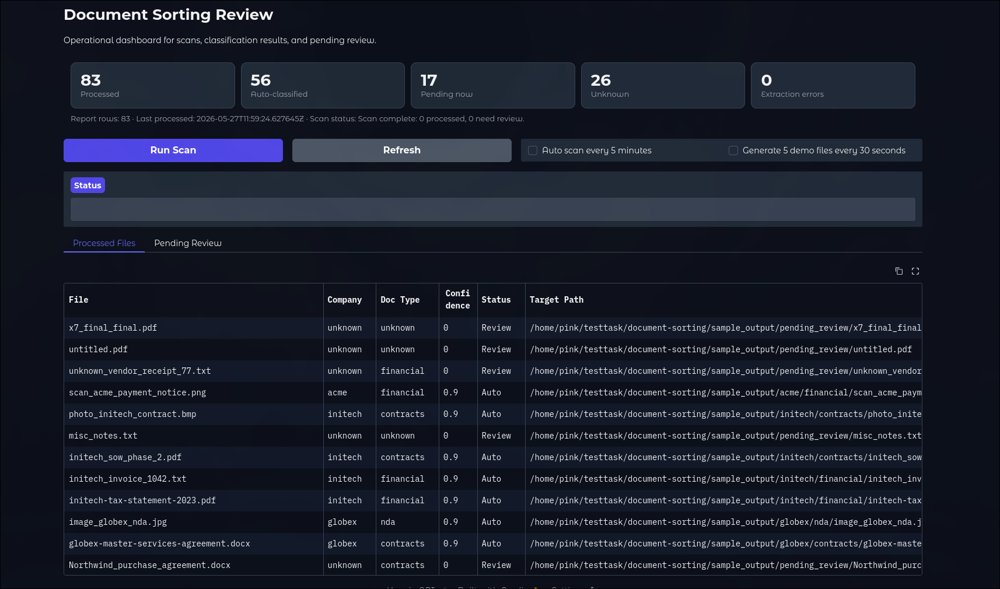
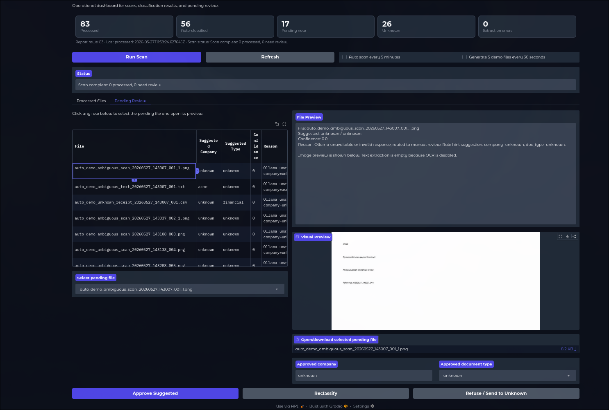

# AI-Assisted Document Sorting

Document sorting workflow. It recursively scans incoming files, extracts text and metadata, classifies company and document type, and routes each file into a predictable folder structure. Low-confidence items are sent to review instead of being sorted automatically.

## What It Does

- Recursively scans `sample_input/`
- Supports `.txt`, `.md`, `.csv`, `.pdf`, `.docx`, and common image files
- Extracts text, metadata, and optional OCR
- Uses deterministic rules first, then Ollama for ambiguous cases
- Copies or moves files into `sample_output/{company}/{doc_type}/`
- Routes uncertain files to `sample_output/pending_review/`
- Writes JSONL audit/report files plus a summary JSON
- Skips already processed files using SHA-256 plus file size
- Exposes a simple Gradio review UI

## Requirement Coverage

| Requirement | Implementation |
| --- | --- |
| Recursive scan | `docsort.scanner.scan_once()` uses `Path.rglob("*")` |
| Every 5 minutes | `docsort.main watch --interval 300` and the UI scan timer |
| File detection | `docsort.extractor` handles text, PDF, DOCX, and images |
| OCR | Optional Tesseract OCR for images and low-text PDFs |
| Classification inputs | Filename, metadata, extracted text, and rule hints |
| Copy/move | `docsort.organizer.organize_file()` |
| Report | `reports/classification_report.jsonl` and `classification_summary.json` |
| Low confidence confirmation | CLI interactive mode and the UI pending-review queue |
| Docker | `docker compose up --build` |

## Project Layout

```text
docsort/
  main.py         CLI scan/watch commands
  scanner.py      recursive scan, dedupe, reporting
  extractor.py    PDF/DOCX/text/image extraction and OCR
  classifier.py   rule hints, Ollama prompt, validation, fallback
  organizer.py    copy/move and review routing
  ui.py           Gradio review dashboard
  demo_files.py   5-file demo generator for the UI
  config.py       YAML loading and path resolution
  models.py       Pydantic models
  logging.py      Loguru setup
generate_test_files.py  one-shot 20-file fixture generator
sample_input/             incoming fixtures
sample_output/            sorted files and review queue
reports/                  JSONL reports and logs
```

## Sample Input / Output

Representative incoming files:

```text
sample_input/
  acme_invoice_clear.txt
  globex_nda_clear.txt
  ambiguous_review_needed.txt
  unknown_minimal_review.txt
```

Representative output after a scan:

```text
sample_output/
  acme/financial/acme_invoice_clear.txt
  globex/nda/globex_nda_clear.txt
  pending_review/ambiguous_review_needed.txt
  pending_review/unknown_minimal_review.txt
```

The repo also includes larger generated examples under `sample_output/` from demo runs.

## Configuration

- `config.example.yaml` is the local starting point and keeps `qwen3:14b`
- `config.docker.yaml` is mounted by Compose and uses `qwen2.5:7b`
- `action: copy` avoids destructive behavior during testing
- `interactive: true` enables confirmation prompts in the CLI
- `ocr.enabled: true` turns on OCR

## Local Run

```bash
python -m venv .venv
source .venv/bin/activate
pip install -r requirements.txt

ollama pull qwen3:14b
cp config.example.yaml config.yaml
python generate_test_files.py
python -m docsort.main scan --config config.yaml
```

Watch every 5 minutes:

```bash
python -m docsort.main watch --config config.yaml --interval 300
```

Ask for confirmation on low-confidence files:

```bash
python -m docsort.main scan --config config.yaml --interactive
```

Launch the review UI:

```bash
python -m docsort.ui
```

Then open `http://localhost:7860`.

## Docker

```bash
docker compose up --build
```

The compose stack starts:

- `ollama`
- `docsort` watcher every 5 minutes
- `ui` on `http://localhost:7860`

Docker mounts `config.docker.yaml` as `config.yaml`. The Docker config now uses `qwen2.5:7b` because the bundled Ollama image is `0.5.7`, which does not support pulling `qwen3:14b`.

If needed, pull the model inside the container:

```bash
docker compose exec ollama ollama pull qwen2.5:7b
```

The UI also includes:

- auto scan every 5 minutes
- generate 5 demo files every 30 seconds

## Review Flow

- Non-interactive CLI scans route low-confidence files to `pending_review/`
- Interactive CLI mode prompts to accept, override, refuse, or defer
- The UI shows pending files, previews their content, and allows reclassification

## Demo Data

- `generate_test_files.py` recreates `sample_input/` with 20 mixed fixtures across PDFs, DOCX, text, CSV, and images
- `docsort/demo_files.py` powers the UI demo toggle and creates 5 fresh incoming files per batch

## Screenshot



The dashboard shows processed files, pending review items, visual previews, and manual reclassification controls.



The review state shows the pending queue, preview panel, and approve/reclassify controls.

## Reports

- `reports/classification_report.jsonl`: one audit row per processed file
- `reports/processed_manifest.jsonl`: duplicate/processed-file manifest
- `reports/classification_summary.json`: summary stats from the latest scan
- `reports/docsort.log`: rotating application log
- `reports/docsort_errors.log`: errors only

## Pipeline

1. Scan `sample_input/` recursively.
2. Skip files already seen in the manifest.
3. Extract text, metadata, and optional OCR.
4. Build deterministic rule hints.
5. Auto-accept high-confidence rule matches.
6. Call Ollama for ambiguous cases.
7. Normalize the result and route the file.
8. Append the report row and summary stats.

## Validation

- `docker compose up --build`
- `docker compose exec ollama ollama pull qwen2.5:7b`
- `docker compose exec docsort python -m docsort.main scan --config config.yaml`
- `curl http://localhost:7860`

Observed result from the Docker stack:

- `sample_input/test_llm_file.txt` -> `sample_output/globex/nda/test_llm_file.txt`
- `sample_input/test_new_file.txt` -> `sample_output/pending_review/test_new_file.txt` before the model pull

## AI Approach

- Rules extract strong signals from filename, metadata, and text
- Clear cases bypass the model
- Ambiguous cases go to Ollama with a strict JSON-only prompt
- Pydantic validates the model output and normalizes company aliases
- Low-confidence, unknown, or conflicting results go to review

## Tradeoffs

- Polling every 5 minutes instead of filesystem events keeps the behavior predictable and matches the task
- JSONL instead of a database keeps the submission simple and inspectable
- Rules-first routing reduces model calls and latency for obvious files
- A review queue is safer than forcing a guess on uncertain documents

## Limitations

- Single-process sequential scanning
- Confidence is heuristic, not calibrated
- OCR is optional and off by default
- No embeddings or vector index yet
- Docker is pinned to Ollama 0.5.7, so the compose stack uses `qwen2.5:7b`
